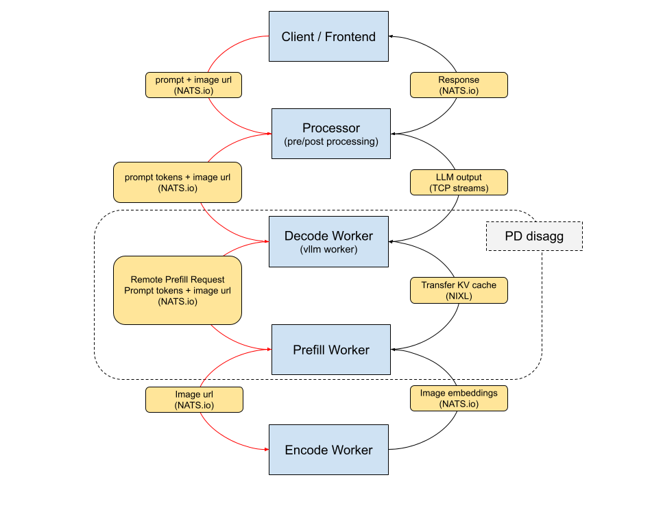

# Dynamo Multimodal Architecture

## Motivation

Multimodal models enhance the capabilities of large language models (LLMs) by enabling them to process diverse input types such as text, images, and audio. While powerful, these models pose significant challenges for efficient and scalable inference.

To address this, the paper [Efficiently Serving Large Multimodal Models Using EPD Disaggregation](https://arxiv.org/pdf/2501.05460) introduces key optimizations—most notably, the **EPD Disaggregation** technique. This approach decomposes the inference process into three distinct stages: **Encode**, **Prefill**, and **Decode**. By separating these phases, the system can unlock higher throughput, better resource utilization, and improved scalability.

The Dynamo multimodal architecture adopts and extends this EPD disaggregation strategy to support efficient serving of large multimodal models.

## High level architecture

Dynamo has already demonstrated [prefill-decode (PD) disaggregation](../disagg_serving.md) for efficient LLM serving. Building on that foundation, this proposal introduces a dedicated **encode worker** to handle the vision encoding step, fully separating the Encode, Prefill, and Decode phases.
The diagram below illustrates the proposed workflow, based on the LLAVA model ( image + text → text) with vLLM.

### Components

- Client / Frontend: Sends a request containing a text prompt and an image URL or path to the serving endpoint.

- Processor: Handles pre-processing of the input prompt and post-processing of the LLM output.

- Decode Worker (vLLM Worker):
  - In aggregation mode, this worker handles all stages of inference.
  - In disaggregated mode, it focuses on decoding and issues a remote prefill request to the Prefill Queue, where the Prefill Worker picks it up.

- Prefill Worker:
  - Handles the prefill stage of inference.
  - In multimodal workflows, it forwards the image URL to the Encode Worker, waits for the returned embeddings, and then proceeds with the prefill using both the text and image features.

- Encode Worker:
  - Encodes multimodal inputs (e.g., images) into embeddings.
  - In this example, it converts an image into vision embeddings and sends them to the Prefill Worker for the prefill stage.
